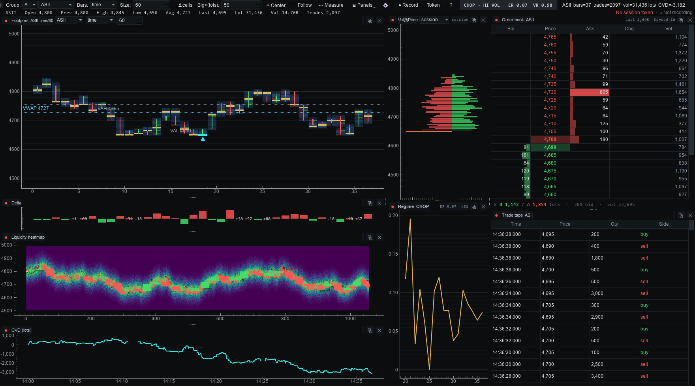

# Orderflow Station

An **orderflow trading terminal for Indonesian equities (IDX)** — footprint charts,
a Bookmap-style liquidity heatmap, a DOM ladder and trade tape, built on live
order-book and tick data from the Stockbit Pro market-data websocket.



> ### ⚠️ Read this first
> - **Unofficial and reverse-engineered.** This project is **not affiliated with,
>   endorsed by, or supported by Stockbit.** It speaks an undocumented private
>   websocket that can change or break at any time.
> - **For personal and educational use.** You are responsible for your own
>   compliance with Stockbit's Terms of Service and any applicable regulations.
> - **Never commit your session frame.** `subscribe_*.txt` embeds a live JWT tied to
>   your account. It is gitignored — keep it that way. Never paste one into an issue,
>   a chat, or a log.
> - **Not financial advice.** No warranty; see [LICENSE](LICENSE).

---

## What it does

| Panel | |
|---|---|
| **Footprint** | Per-bar, per-price bid×ask volume clusters with diagonal imbalance highlighting, gold POC, V/D/R-H/R-L headers, mid OHLC candles, and **absorption markers** (heavy volume rejected at a bar extreme). Switchable to plain candlesticks. |
| **Liquidity heatmap** | Resting book depth over time, rank-equalized so real walls stand out; overlaid price line, OHLC candles, trade bubbles, and dashed lines tracking the **largest resting bid/ask** so you can see your distance to the big orders. |
| **Volume profile** | Session volume-at-price (butterfly), tick-binned, with POC and value area. |
| **CVD** | Cumulative volume delta in lots, with honest line breaks across capture gaps. |
| **DOM + tape** | Quantower-style centered ladder: depth bars, BBO highlight, per-level session volume, a **Chg** column showing size being stacked or pulled, and pinned Σ totals with book imbalance. |
| **Regime filter** | Efficiency Ratio + realized-vol + variance ratio → a TREND / CHOP / MIXED label with a live history panel. See the honest caveat below. |

Everything is tunable from a tabbed **⚙ Settings** panel and persists across restarts.

## Install

```bash
git clone <your-repo-url>
cd orderflow-station
pip install -e .
```

Python ≥ 3.10. Core deps: PySide6, pyqtgraph, numpy, websockets.
For the automatic token grabber (optional):

```bash
pip install -e ".[token]"
playwright install chromium
```

## Get a session token

The websocket does **not** authenticate on the handshake — auth rides inside a
**subscribe frame** that embeds a ~24 h JWT. You need one such frame in `data/`
before anything can connect. One frame works for **any** 4-letter IDX ticker (the
symbol field is swapped in software), so you only re-grab when the *token* expires,
never when you change symbol.

### Option A — automatic (recommended)

```bash
pip install -e ".[token]"
playwright install chromium

python -m orderflow.token --login   # one time
python -m orderflow.token           # thereafter: headless, ~10 s
```

`--login` opens a Chromium window using its own profile (independent of your everyday
browser). Log into Stockbit, open **any ticker's chart**, then return to the terminal and
press Enter. It saves the login and remembers that page, so later runs are headless and
silent, writing `data/subscribe_auto.txt`.

You can also fold it into launch instead of running it separately:

```bash
python -m orderflow.capture ASII --grab      # grab, then start capturing
```

If the grab fails (Playwright missing, expired login), it prints one line and **falls back
to your existing frame** rather than blocking startup.

### Option B — manual grab (no Playwright, ~2 minutes)

<details>
<summary><b>Step-by-step browser tutorial</b></summary>

1. Open **[stockbit.com](https://stockbit.com)** and log in.
2. Press **F12** → **Console** tab. If pasting is blocked, type `allow pasting` and Enter.
3. Paste this catcher and press Enter — it hooks outgoing websocket frames and downloads
   the subscribe frame in exactly the format this project reads:

   ```js
   (() => {
     const send = WebSocket.prototype.send;
     let best = 0;
     WebSocket.prototype.send = function (data) {
       try {
         if (data instanceof ArrayBuffer || ArrayBuffer.isView(data)) {
           const b = new Uint8Array(data instanceof ArrayBuffer ? data : data.buffer);
           let sym = null;                       // 0x04 + 4 uppercase letters = a ticker
           for (let i = 0; i + 4 < b.length; i++) {
             if (b[i] === 4 && [1,2,3,4].every(j => b[i+j] >= 65 && b[i+j] <= 90)) {
               sym = String.fromCharCode(b[i+1], b[i+2], b[i+3], b[i+4]); break;
             }
           }
           if (b.length > 200 && sym && b.length > best) {
             best = b.length;
             const a = document.createElement('a');
             a.href = URL.createObjectURL(
               new Blob([Array.from(b).join(',')], { type: 'text/plain' }));
             a.download = `subscribe_${b.length}.txt`;
             a.click();
             console.log(`captured ${b.length}B subscribe frame for ${sym}`);
           }
         }
       } catch (e) {}
       return send.apply(this, arguments);
     };
     console.log('catcher armed — now open a ticker chart');
   })();
   ```

4. **Open a ticker you haven't loaded yet this session** (e.g. ASII). The console logs
   `captured 922B subscribe frame for ASII` and a `subscribe_922.txt` lands in your
   Downloads folder. Allow the download if the browser asks.
5. Move that file into the project's **`data/`** directory:

   ```bash
   mv ~/Downloads/subscribe_922.txt "data/"
   ```

**Notes**
- The catcher only downloads a frame **larger** than the previous one, so you may get a
  couple of files. **Keep the largest** — that variant carries all four feed channels
  (book *and* trades); smaller ones carry fewer.
- The file is comma-separated decimal bytes, e.g. `10,7,49,54,...`. Nothing else parses.
- Reload the page to disarm the catcher.

</details>

### Token expiry

Tokens last ~24 h and also die if you log in elsewhere (session rotation). **Symptom:** the
socket connects but no data arrives — with `--debug` you'll see an explicit
`you are not authorized` status. Fix: grab a fresh frame.

> `data/` is gitignored precisely because these frames identify your account. Never commit
> or paste one.

## Usage

### Try it without a token

If you have captured CSVs in `data/`, the whole GUI runs offline — no connection, no
token. This is also the fastest way to explore the interface:

```bash
python -m orderflow.app --replay --symbol ASII
```

### A trading session, start to finish

```bash
# 1. before the open — start the capture daemon in ITS OWN terminal.
#    It owns the CSV files and must keep running all session.
python -m orderflow.capture ASII --grab

# 2. any time — open the chart beside it. --view-only means "don't write CSVs".
#    Close and reopen this freely; the daemon never misses a tick.
python -m orderflow.app --live --symbol ASII --view-only --debug

# 3. after the close — fold the day into the regime evaluation
python -m orderflow.backtest --symbol ASII
```

> **⚠️ Only one process may write the CSVs.** The daemon is the writer; any chart running
> beside it needs `--view-only`. Two writers interleave rows and corrupt the archive.
>
> **⚠️ Don't run the daemon as a background job of a shell that might exit** — if it dies
> mid-session you lose that stretch of tape (the reconnect backfill only recovers ~40
> recent trades). Give it a terminal window of its own and confirm it's alive by watching
> `data/book.csv`'s modification time.

Installed console scripts `orderflow-app`, `orderflow-capture`, `orderflow-backtest` are
equivalent to the `python -m orderflow.*` forms.

### Command reference

**`orderflow.app`** — the terminal

| flag | |
|---|---|
| `--replay` / `--live` | chart captured CSVs (default) or connect to the feed |
| `--symbol ASII` | 4-letter IDX ticker |
| `--view-only` | live mode without writing CSVs — **required** alongside the daemon |
| `--grab` | refresh the session token on launch |
| `--debug` | diagnostics status bar (flow, book health, feed age, integrity check) |
| `--bars time\|tick\|volume`, `--size N` | bar basis and size |
| `--history today\|all\|none` | how much captured history to preload in live mode |
| `--shot out.png [--secs N]` | render once to PNG and exit (headless) |
| `--reset-layout` / `--reset-settings` | recover from an off-screen window or a bad config |

**`orderflow.capture`** — headless daemon: `orderflow.capture [SYMBOL] [--grab]`

**`orderflow.backtest`** — regime evaluation

| flag | |
|---|---|
| `--symbol ASII` | which symbol's captured days to evaluate |
| `--window 20 --warmup 20` | ER lookback (bars) and warm-up gate (minutes) |
| `--er-trend 0.5 --er-chop 0.3` | label thresholds |
| `--horizons 5,10,20` | forward horizons in bars |
| `--fees 0.15,0.25` | %/side buy,sell (IDX retail defaults) |
| `--csv out.csv` | dump per-signal rows |

**`orderflow.token`** — `--login` (one-time), `--headed` (debug the grab), `--url`, `--wait`

### In the chart

| | |
|---|---|
| **⚙ Settings** | tabbed panel — footprint, heatmap, DOM & tape, layout, general. Everything persists. |
| **⌖ Center / Home** | jump to the latest bars, keeping your zoom |
| **Follow** | auto-scroll to new bars; panning back into history switches it off |
| **Δ cells** | switch cluster cells to delta heat |
| **Big≥ (lots)** | highlight threshold for large prints in the tape |

Chart style (clusters vs candlesticks), imbalance and absorption thresholds, heatmap
palette and contrast, DOM depth and columns all live in **⚙ Settings**.

## Architecture

```
orderflow/
  paths.py     one place for every file location ($ORDERFLOW_DATA overrides the archive)
  feed.py      websocket protocol, frame parsing, CSV persistence, live + replay feeds
  model.py     pure aggregation, NO Qt — footprint, CVD, volume profile, book, heatmap,
               trade classification, regime filter
  app.py       PySide6/pyqtgraph GUI (all rendering; reads from model)
  backtest.py  walk-forward regime evaluation, no GUI
  capture.py   headless capture daemon
  token.py     Playwright session-token grabber
tools/         standalone helpers (protobuf frame decoder)
docs/          protocol reference + images
data/          captured CSVs, session frames, browser profile — gitignored
```

The **model layer has no Qt dependency**: `feed → model` is fully usable headless, which
is how the backtest and daemon work. Both live and replay emit the same
`("book" | "trade" | "summary", …)` event stream, so the GUI can't tell them apart.

Captured data lands in `data/` as `book.csv`, `trades.csv`, `summary.csv` and a raw
`capture_raw.jsonl`. Point `ORDERFLOW_DATA` elsewhere to keep the archive off the repo drive.

## The regime filter — an honest note

The TREND/CHOP label is Kaufman Efficiency Ratio + a realized-volatility percentile,
with a Lo–MacKinlay variance ratio alongside. Method choice was driven by a literature
survey favouring simple, intraday-validated indicators over Hurst/HMM/BOCPD.

**It has not been validated on IDX data.** On six captured ASII days (201 evaluations)
the only label doing real work was **CHOP** — it reliably preceded low forward efficiency
and 1–2 tick moves. `TREND↑` fired twice in six days: far too few to judge. Treat the
chip as a *stay-out filter*, not a trend caller, and don't loosen the thresholds to make
it fire more — that's fitting noise. `backtest.py --sweep` deliberately refuses to tune
thresholds on fewer than 8 captured days.

## Development

- `python -m py_compile orderflow/*.py` — quick syntax gate.
- The GUI renders headless for verification: `python -m orderflow.app --replay --shot out.png`.
- `tools/decode_frame.py` dumps an unknown protobuf frame's field structure — the tool
  used to decode the trade format.
- Frame formats, units and gotchas: **[docs/protocol.md](docs/protocol.md)**.

Two units traps worth knowing before touching aggregation code: order-book `value` is
**shares** (`lots = value / 100`), and instrument tick size is derived from the **book
ladder**, not from traded prices — a sparse day or an off-tick negotiated print
otherwise corrupts the price grid.

## License

MIT — see [LICENSE](LICENSE).
