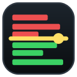
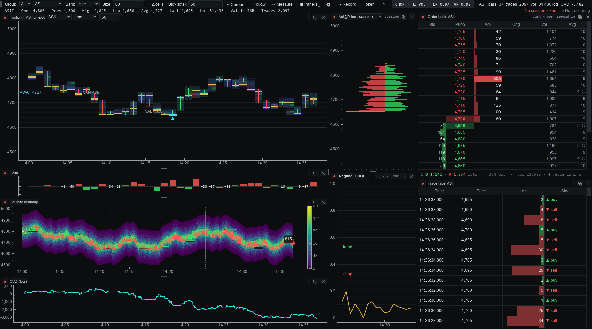
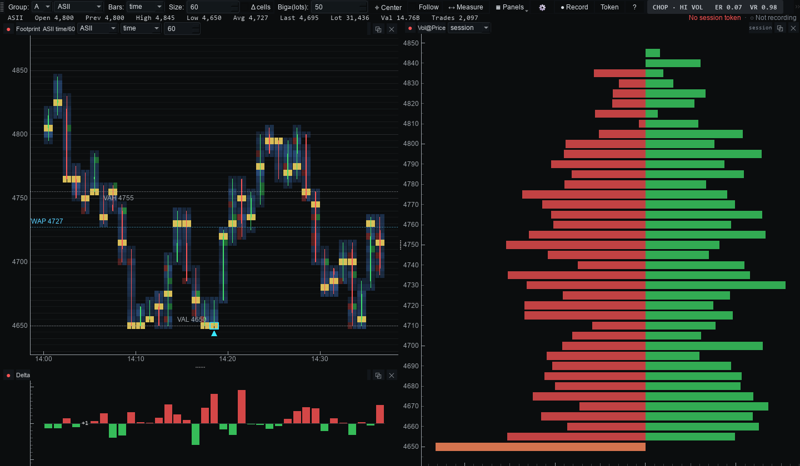
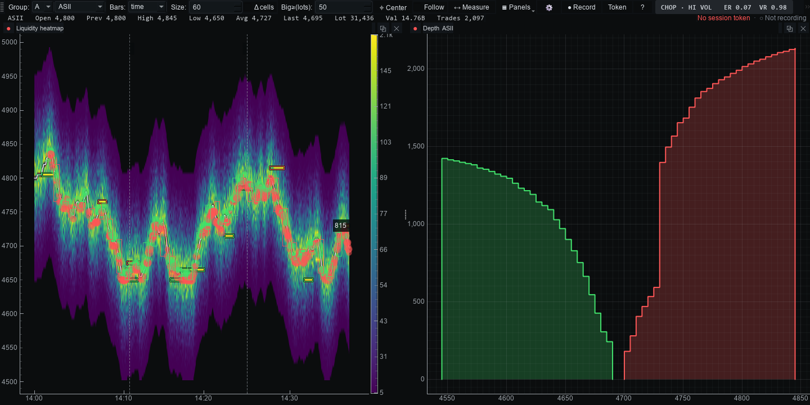
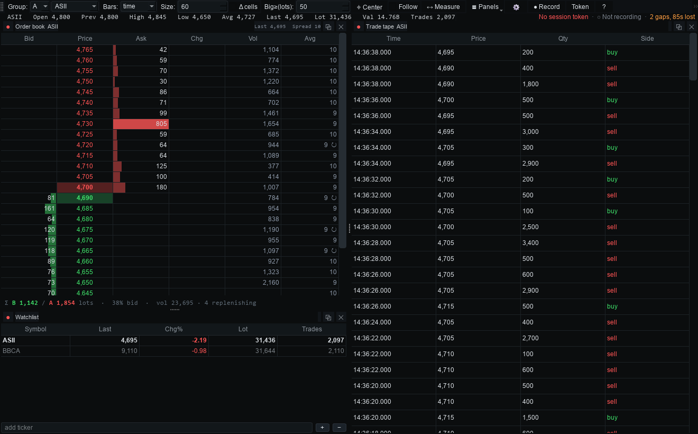
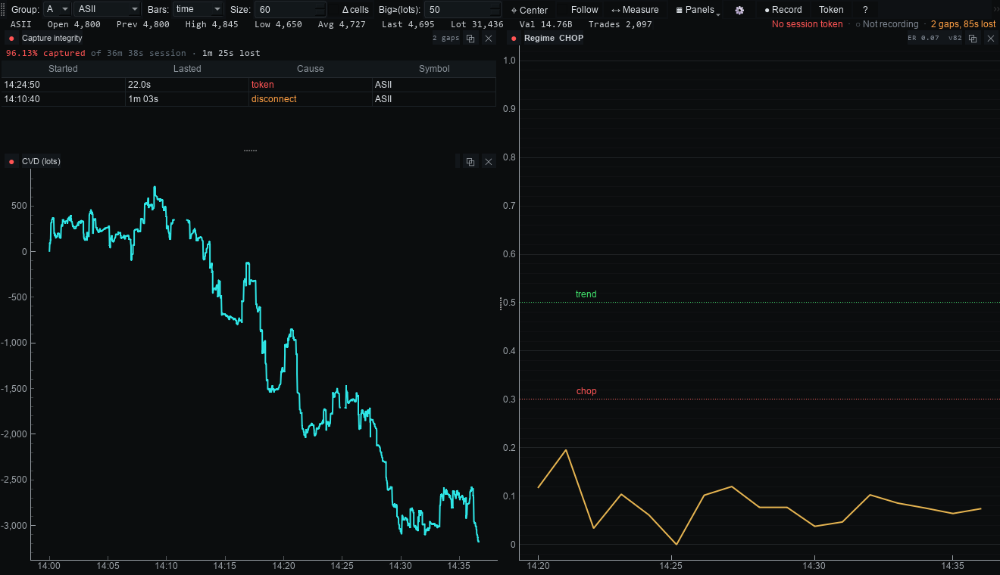
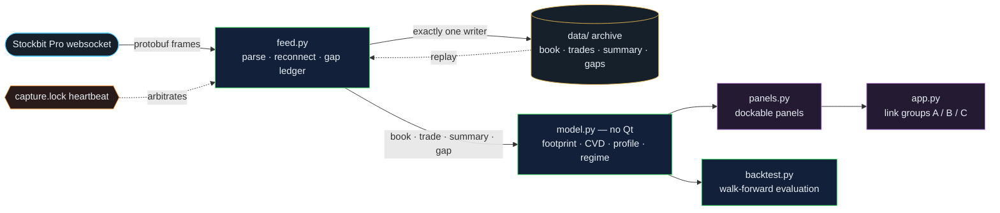

<h1> Orderflow Station</h1>

[](https://github.com/silenccy/orderflow-station/actions/workflows/ci.yml)
[](https://github.com/silenccy/orderflow-station/tags)
[](https://www.python.org/downloads/)
[](LICENSE)

An **orderflow trading terminal for Indonesian equities (IDX)** — footprint charts,
a Bookmap-style liquidity heatmap, a DOM ladder and trade tape, built on live
order-book and tick data from the Stockbit Pro market-data websocket.



<sub>Screenshots are rendered headlessly by `tools/make_previews.py` from a <b>synthetic</b>
random-walk session — the shapes are real, the prices are invented. Regenerate them with
<code>python tools/make_previews.py</code>.</sub>

> ### ⚠️ Read this first
> - **Unofficial and reverse-engineered.** This project is **not affiliated with,
>   endorsed by, or supported by Stockbit.** It speaks an undocumented private
>   websocket that can change or break at any time.
> - **For personal and educational use.** You are responsible for your own
>   compliance with Stockbit's Terms of Service and any applicable regulations.
> - **Never commit your session frame.** `subscribe_*.txt` embeds a live JWT tied to
>   your account. It is gitignored — keep it that way. Never paste one into an issue,
>   a chat, or a log.
> - **Not financial advice.** No warranty; see [LICENSE](LICENSE).

**Working on the code?** Start at [For developers](#for-developers): set-up, tests, how to
work without a live market, the rules this codebase learned the hard way, and how to debug
a crash that leaves no traceback.

---

## What it does

| Panel | |
|---|---|
| **Footprint** | Per-bar, per-price bid×ask volume clusters with diagonal imbalance highlighting, gold POC, V/D/R-H/R-L headers, mid OHLC candles, and **absorption markers** (heavy volume rejected at a bar extreme). Switchable to plain candlesticks. |
| **Liquidity heatmap** | Resting book depth on a **clock-time** axis, each level painted across its real IDX tick band — no stripes where the tick size changes at 200 / 500 / 2,000 / 5,000. A colour legend in **lots** and a hover readout (`09:12:40 · 202 · bid 182,400 lots`) say what you are looking at; beyond the feed's visible depth stays dark rather than passing for "no liquidity". **Persistent walls** — levels that held ≥ *Wall × median* for 30 s — are outlined, the standing ones labelled with their size. Candles are hollow so they never hide the book. |
| **Volume profile** | Session volume-at-price (butterfly), tick-binned, with POC and value area. |
| **CVD** | Cumulative volume delta in lots, with honest line breaks across capture gaps. |
| **DOM + tape** | Quantower-style centered ladder: depth bars, BBO highlight, per-level session volume, a **Chg** column showing size being stacked or pulled, an **Avg** column (average order size — one big order and a crowd of small ones look identical by depth alone), and pinned Σ totals with book imbalance. |
| **Iceberg-style replenishment** | Flags levels that keep getting **refilled after trades eat into them**, including the same-second refill that shows no net change on the ladder — marked `↻` in the DOM with how often and how much was put back. Uses the feed's per-level order count to tell one order reloading from a crowd arriving. A heuristic, not proof: see [the honest note](#replenishment-detection--an-honest-note). |
| **Regime filter** | Efficiency Ratio + realized-vol + variance ratio → a TREND / CHOP / MIXED label with a live history panel. See the honest caveat below. |
| **Capture integrity** | Every hole in the tape — when the feed dropped, for how long, and why — with the share of the session actually captured. The feed reconnects by itself; this is what it missed. |
| **Watchlist** | Every symbol in your archive with last, change %, lot and trade count. Click to point a link group at it; double-click to open a new footprint for it. |
| **Signal log** | Running list of the absorption and diagonal-imbalance events the footprint already detects, with time and price. Click a row to jump the chart there. |
| **Depth curve** | Cumulative resting size either side of the touch — where liquidity thins out. |

Every panel is an independent dock: drag it anywhere, snap it, split it, tab it, float it
onto a second monitor, or close it. Open more than one of the same kind on different symbols
or bar bases. The arrangement is saved on exit and restored on launch.

**Footprint, delta footer and volume profile** — bid×ask clusters with a gold POC, VWAP and
value-area lines, per-bar delta underneath.



**Liquidity heatmap and depth curve** — resting size against clock time, with the price line,
hollow candles, persistent walls and a legend in lots; dashed lines mark where the feed
dropped. Cumulative book depth beside it. *(Synthetic session, like every screenshot here.)*



**Order book, tape and watchlist** — centred ladder with depth bars, BBO highlight, Σ totals
and book imbalance. The **Avg** column is average order size per level; `↻` marks a level
being replenished, and the footer counts them ("4 replenishing").



**Capture integrity** — every hole in the tape with its cause and duration, the share of the
session captured, and the CVD line broken exactly where the data is missing.



Everything else is tunable from a tabbed **⚙ Settings** panel and persists across restarts.

## Install

```bash
git clone <your-repo-url>
cd orderflow-station
pip install -e .
```

Python ≥ 3.10. Deps: PySide6, pyqtgraph, numpy, websockets.

### Then just run it

Double-click **`Orderflow Station.bat`** (Windows). No terminal, no console window.

A **Start** dialog asks what you want — replay or live, which tickers, bar basis,
whether to record — and remembers it if you tick the box. Everything the flag tables
at the bottom describe has a button somewhere in the window; the flags are there for
scripting, not for you.

Hold **Shift** while launching to get the dialog back after you have ticked "remember".

### If it will not start

Double-click **`Diagnose.bat`**. It prints where the app is looking, what Qt platform it
found, your token and recorder state, whether the saved window position still lands on a
connected screen, and the tail of both logs.

Two logs are written to `data/`:

| | |
|---|---|
| `launch.log` | everything the app printed. Under `pythonw.exe` there is no console, so the app **redirects its own streams here** — otherwise a failed launch produces no window and no message, which is exactly the trap this replaced. |
| `crash.log` | full tracebacks, including ones from feed threads and interpreter-level faults |

A crash after the window exists also raises an error dialog. If the app starts but a symbol
never ticks, the status bar names the reason — a missing token now reads *"no session token
— click Token to grab one"* instead of failing silently.

## Get a session token

The websocket does **not** authenticate on the handshake — auth rides inside a
**subscribe frame** that embeds a ~24 h JWT. You need one such frame in `data/`
before anything can connect. One frame works for **any** 4-letter IDX ticker (the
symbol field is swapped in software), so you only re-grab when the *token* expires,
never when you change symbol.

**In the app:** click **Token** in the toolbar. It walks you through the steps, hands
you the snippet with a Copy button, and watches `data/` so it can confirm the frame
landed and tell you its size and symbol. The toolbar then shows the token's age.

The manual route below is the same thing, done yourself.

### Grab it from your browser console (~2 minutes)

You grab the frame by hand, from your own logged-in browser. There is no automated
grabber: headless-browser login is blocked by Google SSO, and a scripted browser holding
a live brokerage session is a liability you don't need for a 2-minute job.

1. Open **[stockbit.com](https://stockbit.com)** and log in.
2. Press **F12** → **Console** tab. If pasting is blocked, type `allow pasting` and Enter.
3. Paste this catcher and press Enter — it hooks outgoing websocket frames and downloads
   the subscribe frame in exactly the format this project reads:

   ```js
   (() => {
     const send = WebSocket.prototype.send;
     let best = 0;
     WebSocket.prototype.send = function (data) {
       try {
         if (data instanceof ArrayBuffer || ArrayBuffer.isView(data)) {
           const b = new Uint8Array(data instanceof ArrayBuffer ? data : data.buffer);
           let sym = null;                       // 0x04 + 4 uppercase letters = a ticker
           for (let i = 0; i + 4 < b.length; i++) {
             if (b[i] === 4 && [1,2,3,4].every(j => b[i+j] >= 65 && b[i+j] <= 90)) {
               sym = String.fromCharCode(b[i+1], b[i+2], b[i+3], b[i+4]); break;
             }
           }
           if (b.length > 200 && sym && b.length > best) {
             best = b.length;
             const a = document.createElement('a');
             a.href = URL.createObjectURL(
               new Blob([Array.from(b).join(',')], { type: 'text/plain' }));
             a.download = `subscribe_${b.length}.txt`;
             a.click();
             console.log(`captured ${b.length}B subscribe frame for ${sym}`);
           }
         }
       } catch (e) {}
       return send.apply(this, arguments);
     };
     console.log('catcher armed — now open a ticker chart');
   })();
   ```

4. **Open a ticker you haven't loaded yet this session** (e.g. ASII). The console logs
   `captured 922B subscribe frame for ASII` and a `subscribe_922.txt` lands in your
   Downloads folder. Allow the download if the browser asks.
5. Move that file into the project's **`data/`** directory:

   ```bash
   mv ~/Downloads/subscribe_922.txt "data/"
   ```

   ```powershell
   move "$env:USERPROFILE\Downloads\subscribe_922.txt" ".\data\"
   ```

**Notes**
- The catcher only downloads a frame **larger** than the previous one, so within one
  session you may get a couple of files — the last (largest) is the real one. That variant
  carries all four feed channels (book *and* trades); smaller ones carry fewer.
- The loader picks the **newest** parseable `subscribe_*.txt` in `data/`, so tomorrow's
  grab wins over today's without you deleting anything. Old frames are harmless clutter.
- The file is comma-separated decimal bytes, e.g. `10,7,49,54,...`. Nothing else parses.
- Reload the page to disarm the catcher.

### Token expiry

Tokens last ~24 h and also die if you log in elsewhere (session rotation). The toolbar
shows the age and turns amber past 20 h, red past 24 h — click **Token** and grab a fresh
one. **Symptom if you miss it:** the socket connects but no data arrives (with `--debug`,
an explicit `you are not authorized` status).

> `data/` is gitignored precisely because these frames identify your account. Never commit
> or paste one.

## Usage

### Try it without a token

Pick **Replay** in the Start dialog. If you have captured CSVs in `data/`, the whole
workstation runs offline — no connection, no token. Fastest way to explore the interface.

### A trading session, start to finish

Steps 1 and 2 — the whole trading day — need no terminal and no flags: just the launcher
and the Start dialog. Only the optional evaluation in step 3 is a command.

1. **Before the open — check the token first.** Launch (double-click
   **Orderflow Station.bat**) and look at the token line in the Start dialog. Green means
   good for the day. Red means press **Get token…** and grab a fresh one: tokens last
   about 24 hours, and a live session without one connects and then shows nothing at all.

   Then pick **Live**, tick your symbols, tick **Also record to disk**, and press
   **Start**. That checkbox starts the recorder as its own detached process and leaves
   the chart as a reader — which is what keeps the archive safe if the window dies.

   > If the chart stays empty, it is almost always the token. The status bar says
   > `no session token — click Token to grab one`, and the **Token** button in the
   > toolbar grabs one without restarting. For anything stranger, double-click
   > **Diagnose.bat**.
2. **During** — chart freely. Add, move and tab panels; change symbols and bar bases.
   Close and reopen the window whenever you like: **recording keeps running**, because
   the recorder is a detached process, not a child of the chart.

   Every symbol you ticked is **watched** — subscribed, and ticking in the Watchlist
   panel — whether or not a chart is pointed at it. Watching costs a feed and three
   counters; only the symbols you actually chart keep a replay buffer in memory. The
   toolbar says `watching 6 · charting 2` whenever the two differ. Use the Watchlist
   panel's `+` / `−` to follow a ticker without giving up screen space to it.
3. **After the close** — press **Stop**. Optionally fold the day into the regime
   evaluation, which is the one part with no button:
   `orderflow-backtest --symbol ASII`.

The toolbar's **Record** button and the status chip beside it always tell you who is
writing: *this window*, a separate recorder, or nobody.

> **You can no longer corrupt the archive by accident.** Exactly one process may write
> the CSVs, and that is now enforced by `data/capture.lock` rather than asked of you:
> a second recorder refuses to start, and a chart that finds someone already recording
> quietly goes view-only and says so. The old `--view-only` flag still exists, but you
> no longer have to remember it.
>
> Stopping is cooperative — the app creates `data/capture.stop`, and the recorder closes
> its CsvSink properly and removes the lock. Nothing is ever killed mid-write.

### Several symbols at once

Tick as many as you like in the Start dialog, or add them later from the toolbar or the
**Watchlist** panel. One recorder handles all of them.

You do **not** need a second session frame. One captured frame subscribes any 4-letter
IDX ticker — `feed.make_subscribe_for()` swaps the symbol bytes — so a frame grabbed on
ASII drives every symbol you list. Re-grab only when the *token* expires.

One process opens one websocket per symbol and funnels them all through a single shared
`CsvSink`. Everything downstream already understands a mixed archive: `book.csv` and
`trades.csv` carry a `symbol` column, and `replay_feed`, the chart and the backtest all
filter on it.

The first three symbols seed link groups A, B and C. Put each footprint (and the panels that follow it) on a different coloured link group;
see [Link groups](#link-groups). You can also switch a group's symbol at any time from the
toolbar, a panel's title bar, or the **Watchlist** panel — no restart.

Adding symbols costs bandwidth and one connection each, so start with the few you
actually watch.

> **Only one process may write the CSVs** — one *process*, not one symbol. A single
> recorder with five symbols is fine; two recorders with one symbol each is not. Two
> writers interleave rows mid-snapshot, and because `replay_feed` regroups book levels
> with `itertools.groupby` (which only groups *adjacent* rows), the archive is left full
> of shredded snapshots that still parse. You wouldn't notice until you replayed it.
>
> `data/capture.lock` enforces this now, so it is not something you have to get right.
>
> If you want separate archives per symbol anyway, point `ORDERFLOW_DATA` somewhere
> different for each recorder — separate directories, separate locks, no conflict.
>
> **Dropped sockets heal themselves.** The feed reconnects with an exponential backoff
> (0.5 s up to 30 s, jittered so several symbols don't retry in lockstep), and the server's
> replayed backfill is deduplicated by trade id, so the tape never doubles up.
>
> **Every hole is recorded, not inferred.** Each outage is written to `data/gaps.csv` with
> its start, duration and cause, and shown in the **Capture integrity** panel along with the
> percentage of the session actually captured. An expired token is reported as its own cause
> rather than looking like a quiet market. What was missed is still gone — the backfill only
> replays ~40 trades — but you can now see exactly what you lost instead of guessing.

Installed console scripts `orderflow-app`, `orderflow-capture`, `orderflow-backtest` are
equivalent to the `python -m orderflow.*` forms.

### Command reference (optional)

You do not need any of this — it is all reachable from the window, and the same table is
in **Help ▸ ?** in the toolbar. The flags exist for scripting and headless rendering.

**`orderflow.app`** — the terminal

| flag | |
|---|---|
| `--replay` / `--live` | chart captured CSVs (default) or connect to the feed |
| `--symbol ASII BBCA` | one or more 4-letter tickers; all are watched, the first three seed link groups A, B and C |
| `--view-only` | live mode without writing CSVs — applied automatically when something else holds the writer lock |
| `--debug` | diagnostics status bar (flow, book health, feed age, integrity check) |
| `--bars time\|tick\|volume`, `--size N` | bar basis and size |
| `--history today\|all\|none` | how much captured history to preload in live mode |
| `--shot out.png [--secs N]` | render once to PNG and exit (headless) |
| `--doctor` | print environment, paths, token, recorder and screen diagnostics, then exit |
| `--ask` | show the Start dialog even if you ticked "remember" (Shift at launch does the same) |
| `--reset-layout` | forget the saved geometry, dock layout and panel roster |
| `--reset-settings` | forget all saved Settings-panel values (recover from a bad config) |

**`orderflow.capture`** — the recorder

| flag | |
|---|---|
| `orderflow-capture ASII BBCA` | record several tickers concurrently into one archive |
| `--status` | is anything recording? |
| `--stop` | ask the current writer to shut down cleanly |

Refuses to start (exit 3) if another writer holds `data/capture.lock`.

**`orderflow.backtest`** — regime evaluation

| flag | |
|---|---|
| `--symbol ASII` | which symbol's captured days to evaluate |
| `--window 20 --warmup 20` | ER lookback (bars) and warm-up gate (minutes) |
| `--er-trend 0.5 --er-chop 0.3` | label thresholds |
| `--horizons 5,10,20` | forward horizons in bars |
| `--fees 0.15,0.25` | %/side buy,sell (IDX retail defaults) |
| `--csv out.csv` | dump per-signal rows |

### Arranging the workstation

**▦ Panels** lists every open panel with a checkbox — untick to hide, tick to bring back.
Below that, **Add panel** opens another instance of any widget (it appears floating, so you
can drop it where you want) and **Remove panel** deletes one for good. **Reset to default
layout** puts everything back.

Drag a panel by its title bar to move it. Qt handles the snapping: drop it against an edge
to dock, between two panels to split, or *onto* another panel to tab them together. Drag the
seam between panels to resize. The ⧉ button floats a panel — useful for a second monitor.

### Link groups

The coloured dot on each panel's title bar is its **link group**. Panels sharing a colour
share a symbol, a bar basis, a crosshair and an x-axis — so a footprint, its delta footer,
its profile and its DOM all move together. Click the dot to cycle
**grey → red → blue → green**; grey means unlinked, and an unlinked panel keeps its own
private symbol and bar basis.

That is what makes several symbols work at once: put one footprint on red/ASII and another
on blue/BBCA, and each pulls its own panels along. The toolbar's **Group** selector chooses
which group the symbol and bar controls drive.

### In the chart

| | |
|---|---|
| **▦ Panels** | show/hide, add, remove panels; reset the layout |
| **⚙ Settings** | tabbed panel — footprint, heatmap, DOM & tape, layout, general. Everything persists. |
| **⌖ Center / Home** | jump to the latest bars, keeping your zoom |
| **Follow** | auto-scroll to new bars; panning back into history switches it off |
| **↔ Measure** | click two points on a footprint for ticks, %, elapsed time and the volume traded between them |
| **Δ cells** | switch cluster cells to delta heat |
| **Big≥ (lots)** | which prints get the gold highlight in the tape, **per stock**. `auto · N` (the default) means that stock's own top 5% of prints — N is the number auto chose. Type a number to override it for the active stock only; `0` goes back to auto. |

Moving the cursor over a chart puts a **crosshair** on every panel in the same link group,
and the footprint's title bar reads out the price plus that cell's bid, ask, delta and total.

**Vol@Price** has a *session / visible* switch in its title bar. On **visible** it rebuilds
the profile from only the bars currently in view on its linked footprint, so POC and the
value area follow your zoom instead of describing the whole day.

Chart style (clusters vs candlesticks), imbalance and absorption thresholds, heatmap
palette and contrast, DOM depth and columns all live in **⚙ Settings**.

## Architecture


```mermaid
flowchart LR
    WS([" Stockbit Pro websocket "])
    ARCH[("data/ archive<br/>book · trades · summary · gaps")]
    LOCK{{"capture.lock heartbeat"}}
    FEED["feed.py<br/>parse · reconnect · gap ledger"]
    MODEL["model.py — no Qt<br/>footprint · CVD · profile · regime"]
    PANELS["panels.py<br/>dockable panels"]
    APP["app.py<br/>link groups A / B / C"]
    BT["backtest.py<br/>walk-forward evaluation"]

    WS -->|protobuf frames| FEED
    ARCH -.->|replay| FEED
    FEED -->|exactly one writer| ARCH
    LOCK -.->|arbitrates| FEED
    FEED -->|book · trade · summary · gap| MODEL
    MODEL --> PANELS
    PANELS --> APP
    MODEL --> BT

    class WS ext
    class ARCH store
    class LOCK lock
    class FEED,MODEL,BT core
    class PANELS,APP ui

    classDef ext fill:#16202b,stroke:#5ad1ff,color:#e6edf3
    classDef store fill:#16202b,stroke:#e6b450,color:#e6edf3
    classDef lock fill:#2a1b1b,stroke:#ff9f43,color:#e6edf3
    classDef core fill:#12203a,stroke:#3fe26a,color:#e6edf3
    classDef ui fill:#241b33,stroke:#c792ea,color:#e6edf3
```

Live and replay emit the **same** event stream, so nothing downstream can tell them apart —
which is what makes `--replay` a faithful rehearsal rather than a separate code path.

```
orderflow/
  paths.py     one place for every file location ($ORDERFLOW_DATA overrides the archive)
  feed.py      websocket protocol, frame parsing, CSV persistence, live + replay feeds
  model.py     pure aggregation, NO Qt — footprint, CVD, volume profile, book, trade
               classification, regime filter, and HeatGrid (the heatmap as a level
               matrix, updated incrementally, with persistent-wall detection)
  theme.py     colours and the dark stylesheet — "what colour is a buy?"
  settings.py  every tunable value + the dialog that edits them (SETTINGS_SPEC is the
               single source of truth: add a row and the setting appears)
  chart_items.py  the pyqtgraph primitives that paint the charts — footprint clusters,
               delta bars, heatmap candles and walls, DOM depth bars, the clock-time
               axis — and safe_paint, which every custom paint() must wear
  panels.py    every widget as a dockable Panel (footprint, heatmap, DOM, watchlist, ...)
  app.py       the window: model registry, link groups, watchlist, live feed threads,
               and who writes the archive (chart_writes)
  brand.py     the app icon, drawn in code, and its Windows taskbar identity
  startup.py   the dialogs that replace the CLI (Start, Get token, command reference)
  diagnostics.py  crash/launch logging and --doctor (Diagnose.bat); installed BEFORE
               the Qt import
  backtest.py  walk-forward regime evaluation, no GUI
  capture.py   the recorder, and the writer lock every writer shares
Orderflow Station.bat   double-click launcher (pythonw = no console window)
Diagnose.bat            double-click when it will not start (prints --doctor)
tools/         helpers: protobuf frame decoder, multi-subscribe probe,
               preview renderer
docs/          protocol reference + images
data/          captured CSVs, gaps.csv, session frames, capture.lock/.stop/.log
               — gitignored
```

**Who may write the archive** is decided by `data/capture.lock`. Whoever holds it refreshes
its *mtime* every couple of seconds, and that heartbeat is the liveness test — deliberately
not a pid probe, because on Windows `os.kill` with any signal other than
`CTRL_C_EVENT`/`CTRL_BREAK_EVENT` terminates the target, so asking "is the recorder alive?"
would kill it. Shutdown is equally indirect: `data/capture.stop` is a request, and the
writer closes its `CsvSink` and removes the lock itself. Nothing is killed mid-write.

The recorder is started **detached**, not as a child process, so closing the chart does not
stop your capture — which is the entire point of having a recorder. When recording is asked
for from the Start dialog the recorder is the only writer and the chart is a reader
(`app.chart_writes`); only a plain `--live` run makes the chart write.

The window keeps a registry of models keyed by `(symbol, bar_kind, bar_size)`, built lazily
and dropped when no open panel is bound to them. It runs **one feed thread per watched
symbol** — the watchlist plus anything a panel charts — started in `start_live()`, never
during construction. Retention is tiered: only symbols a visible panel draws keep a replay
buffer (book snapshots capped by `book_buffer`, trades never dropped); a symbol that is only
watched costs a connection and three counters.

The **model layer has no Qt dependency**: `feed → model` is fully usable headless, which
is how the backtest and daemon work. Both live and replay emit the same
`("book" | "trade" | "summary" | "gap", …)` event stream, so the GUI can't tell them apart.

Captured data lands in `data/` as `book.csv`, `trades.csv`, `summary.csv` and a raw
`capture_raw.jsonl`. Point `ORDERFLOW_DATA` elsewhere to keep the archive off the repo drive.

## The regime filter — an honest note

The TREND/CHOP label is Kaufman Efficiency Ratio + a realized-volatility percentile,
with a Lo–MacKinlay variance ratio alongside. Method choice was driven by a literature
survey favouring simple, intraday-validated indicators over Hurst/HMM/BOCPD.

**It has not been validated on IDX data.** On six captured ASII days (201 evaluations)
the only label doing real work was **CHOP** — it reliably preceded low forward efficiency
and 1–2 tick moves. `TREND↑` fired twice in six days: far too few to judge. Treat the
chip as a *stay-out filter*, not a trend caller, and don't loosen the thresholds to make
it fire more — that's fitting noise. `backtest.py --sweep` deliberately refuses to tune
thresholds on fewer than 8 captured days.

## Replenishment detection — an honest note

Most people would call this an iceberg detector. It is named for what it can actually see.

Every book level arrives as *price, number of resting orders, total size*. Book snapshots
come about once a second, so a level that is hit and refilled inside one snapshot shows
**no net change** — "did it grow?" is the wrong test. Instead each level is measured
against what *should* have been left:

```
expected = previous size − shares traded at that price since
refill   = new size − expected        # > 0: it was topped back up
```

The order count then separates the two explanations for a refill. Count roughly
unchanged → consistent with **one order reloading** (the iceberg pattern), and counted.
Count jumped → **new participants arrived**, which is not counted.

**What it cannot do is prove it.** The feed is aggregated per price with no order IDs, so
one hidden order reloading and one order leaving while a similar one arrives are
indistinguishable. A `↻` is evidence, not fact. It is reported as refills **per minute**
rather than a session total, because on a stock trading in a few ticks almost every traded
price gets refilled eventually; the rate is what separates a level being actively worked.
Thresholds — refill share, order-count tolerance, minimum occurrences — are in
**Settings → DOM & Tape**. It has so far been checked only against recorded sessions, not
against a live market.

## For developers

Read this section top to bottom once. Most of it is here because something broke without
it.

### Set up

```bash
python -m venv .venv
```
```bash
.venv\Scripts\python.exe -m pip install -e ".[dev]"
```

Windows is the primary platform (it is what CI runs). One command per block on purpose:
Windows PowerShell 5.1 rejects `&&`.

### Run the tests

```bash
python tests/run_all.py
```
```bash
python tests/run_all.py recording
```

The first runs all 25 suites (about 80 s on a laptop); the second runs one by name. `pytest`
and `pytest -k recording` do the same thing. Every suite runs in its own process against a
**throwaway `ORDERFLOW_DATA`**, so the ones that monkeypatch module globals or build a
`QApplication` cannot leak into each other.

**Never run a suite file directly.** Suites write into the data folder — `recording.py`
writes a fake subscribe frame, `diagnostics.py` overwrites `trades.csv` and `book.csv` — and
run as plain scripts that folder would be your real `data/`, holding your session token and
archive. Each suite now imports `tests/suites/_safety.py` first, which refuses to start
without a throwaway folder; keep that import first in any suite you add.

`static_names.py` is pyflakes' undefined-name check on the standard library: it reads every
module in `orderflow/` and `tools/` and fails on any name that does not exist. The crash
fixed in 3.2.1 was exactly that, hidden in a code path that only ran at deep zoom.
[tests/README.md](tests/README.md) explains the layout and what each suite covers. CI runs
the full set on Windows for Python 3.10 and 3.12.

### Work without a live market

The market is open about six hours a day; most work happens outside them.

- **Replay** is the same event stream as live (see Architecture), so
  `python -m orderflow.app --replay` charts whatever is in `data/` and exercises every panel.
- **Headless render** for checking a change by eye:
  `python -m orderflow.app --replay --shot out.png`.
- **Reproduce against real recorded data without touching it.** Set `ORDERFLOW_DATA` to a
  scratch folder so every write goes there, and read the real archive through explicit
  paths: `feed.replay_feed(book_csv=..., trades_csv=..., summary_csv=...)`. That is how the
  3.2.1 crash was reproduced offline — headless, in a loop, without waiting for the open.
- **Fake the websocket, keep everything else real.** `tests/suites/recording.py` encodes
  trades in the real wire format and serves them through a fake `websockets.connect`, so the
  real feed thread, parser and CSV sink all run. Copy that pattern for anything feed-shaped.
- The README screenshots are **synthetic** (`tools/make_previews.py`). Never judge real-data
  behaviour from them: the heatmap's striping above IDX tick-size boundaries was invisible in
  the previews and obvious on real BUMI data.

### Rules this codebase learned the hard way

Each one was a real bug; the version that fixed it is in brackets.

1. **No exception may escape a `paint()`.** PySide turns it into a native access violation
   in `QtCore.pyd`: the window vanishes, no traceback, no dialog. Decorate every custom
   painter with `chart_items.safe_paint`, and pair every `painter.save()` with a `restore()`
   in `try/finally`. Code that runs *inside* pyqtgraph's own paint — axis `tickStrings`,
   legend labels — needs the same care. *(3.2.1)*
2. **Never drop the last reference to a running `QThread`.** Retire a feed with `stop()`
   then `wait()`, as `_sync_feeds` does. `FeedThread.stop()` is safe at any moment after
   `start()`; it used to be ignored in the thread's first instant. *(3.0.1, 3.2.2)*
3. **Feeds start in `start_live()`, never during construction**, so they carry the sink the
   window decides on. *(3.2.2)*
4. **Exactly one process writes the archive**, arbitrated by `data/capture.lock`. Liveness is
   the lock's mtime heartbeat — never `os.kill(pid, 0)`, which on Windows *terminates* the
   process. Anything new that writes must take the lock and heartbeat it. *(2.0.0, 3.2.2)*
5. **Under `pythonw` there is no stdout or stderr.** Anything a user must see goes to a file
   in `data/` (`launch.log`, `crash.log`, `capture.log`); `diagnostics.install()` adopts real
   streams before Qt is imported. A recorder refusal printed only to stderr once made
   recording silently fail. *(2.0.0, 3.2.2)*
6. **Units.** Order-book `value` is **shares** (`lots = value / 100`). Instrument tick size
   comes from the **book ladder**, not traded prices — a sparse day or an off-tick
   negotiated print otherwise corrupts the price grid. IDX changes tick size at
   200 / 500 / 2,000 / 5,000, so never assume one tick per chart. *(the bands: 3.1.0)*
7. **Memory.** `self.events` is the replay buffer models rebuild from: only charted symbols
   keep one, book snapshots are capped by `book_buffer`, trades are never dropped. A liquid
   symbol uncapped is ~36 MB per hour. *(3.1.0)*
8. **The subscribe frame is a live credential.** Never commit, print or log it; `data/` is
   gitignored and must stay so.

### Debugging a crash that leaves no traceback

1. Open `data/crash.log` and find the run: every launch writes a dated
   `faulthandler armed (pid N)` header, and any native dump below it belongs to that run.
   **Diagnose.bat** summarises today's runs, crashes and recordings.
2. Read the thread marked **Current thread**; the first one listed is often an idle
   bystander. Even that stops where Python handed control to Qt: the 3.2.1 crash read
   `GraphicsView.paintEvent` and nothing more, because the item that raised was called
   from C++. It tells you *when*, not *where*. Ask Windows which module faulted:
   ```powershell
   Get-WinEvent -FilterHashtable @{LogName='Application'; ProviderName='Application Error'; StartTime=(Get-Date).AddDays(-1)} | Select-Object -First 3 TimeCreated, Message | Format-List
   ```
3. **Reproduce before you fix.** The 2026-09-08 crash was diagnosed from reading code, the
   fix was real but the wrong one, and the crash came back a month later. Reproduce it live
   if you must, then offline from the recorded session (see above), narrow it by removing
   panels or settings until it stops, and only then change code.
4. Prove the fix both ways: the new test fails on the old code and passes on the new.

### Releasing

The version lives in **one** place, `orderflow/__init__.py`; `pyproject.toml` derives it
and `tests/suites/version.py` fails the build if a second copy ever reappears. To cut a
release:

1. Bump `__version__` — MAJOR if an existing setup breaks (a removed flag, a changed
   on-disk format, a public function that behaves differently), MINOR for new capability,
   PATCH for fixes. Then `pip install -e . --no-deps` so the installed metadata picks up
   the new number; the version suite compares the two.
2. Move the `Unreleased` entries in [CHANGELOG.md](CHANGELOG.md) under the new version and
   add its compare link.
3. `python tests/run_all.py` — the version suite checks the two agree and that the
   release is documented.
4. Merge to `main` **first**, then tag that commit. Check what you are standing on before
   tagging: `git checkout main` on an unmerged repo silently lands you on the *old* tip,
   and the tag then marks code that never contained the release.

```bash
git checkout main
```
```bash
git pull
```
```bash
python -c "import orderflow; print(orderflow.__version__)"
```

   That must print the version you are about to tag. If it prints the *previous* version
   the merge has not landed — stop. Because the version is single-sourced, this is the one
   check that cannot be fooled by being on the wrong commit. Then:

```bash
git tag -a vX.Y.Z -m "orderflow-station X.Y.Z"
```
```bash
git push origin vX.Y.Z
```

5. Publish the GitHub release from that tag, with the version's CHANGELOG section as the
   notes, and check the CI run on `main` is green.

### Where else to look

- Architecture and design rationale: **[docs/ARCHITECTURE.md](docs/ARCHITECTURE.md)**.
- Frame formats, units and gotchas: **[docs/protocol.md](docs/protocol.md)**.
- The GUI is layered so each file answers one question: `theme.py` *what colour is
  this?*, `settings.py` *what can the user change?*, `chart_items.py` *how is it
  painted?*, `panels.py` *what widgets exist?*, `app.py` *how do they fit together?*
  Adding a widget means one class in `panels.py` with a `@register` decorator and one
  line in `app.py`'s `PANEL_MENU`.
- `startup.py` holds the Start/token/help dialogs. `StartDialog.values()` returns exactly
  the keys `main()` reads, so the dialog and the flags build an identical window — if you
  add a flag, add it to both.
- The writer lock lives in `capture.py` (`writer_status` / `take_lock` / `touch_lock` /
  `request_stop`) — the only API rule 4 allows.
- `tools/decode_frame.py` dumps an unknown protobuf frame's field structure — the tool
  used to decode the trade format.
- `tools/probe_multisub.py ASII BBCA` answers, against the live server, whether one
  socket accepts subscriptions for several symbols (`MULTIPLEX`) or the second subscribe
  replaces the first (`SWITCH`). `capture.py` assumes `SWITCH` and opens one socket per
  symbol, which is correct either way; a `MULTIPLEX` result just means it could be cheaper.
  Needs a valid token and market hours.
- `python -m compileall -q orderflow tools tests` — a one-second syntax gate before the
  full run.

## License

MIT — see [LICENSE](LICENSE).
